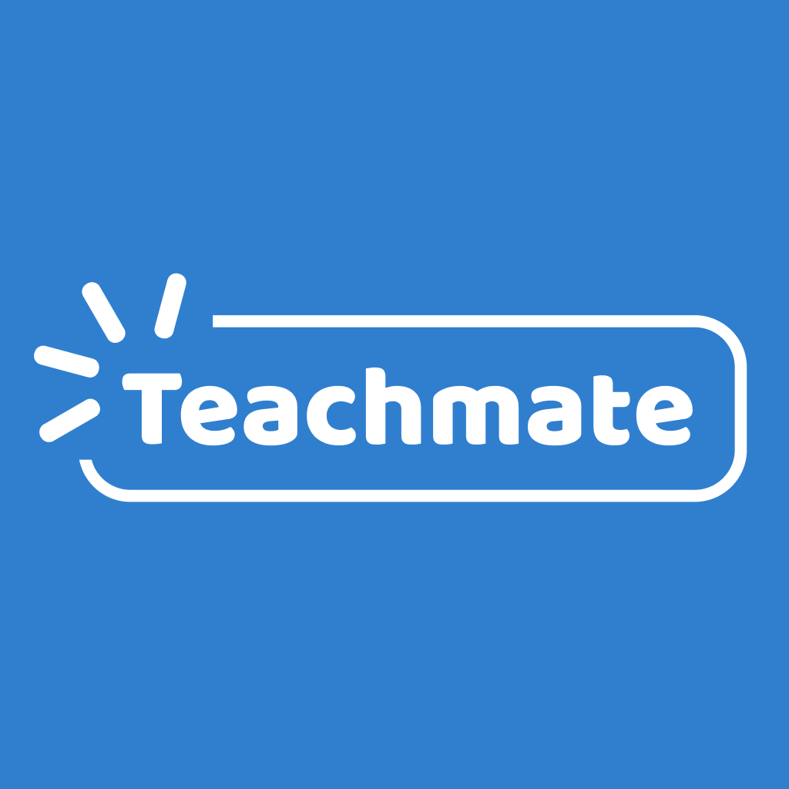

<a name="readme-top"></a>

<!-- PROJECT LOGO -->
<br />
<div align="center">
  <a href="https://github.com/kaninnoothep/Teachmate">
    
  </a>

  <h3 align="center">Teachmate</h3>

  <p align="center">
    Empower Your Learning Journey
    <br />
    <a href="https://github.com/kaninnoothep/Teachmate"><strong>Explore »</strong></a>
    <br />
    <br />
    <a href="https://drive.google.com/file/d/1lDS2fPy3Nth1clOyNSEFzVpQRRPOf5o2/view?usp=sharing">View Demo</a>
    ·
    <a href="https://github.com/kaninnoothep/Teachmate/issues/new?labels=bug&template=bug-report---.md">Report Bug</a>
    ·
    <a href="https://github.com/kaninnoothep/Teachmate/issues/new?labels=enhancement&template=feature-request---.md">Request Feature</a>
  </p>
</div>

<!-- TABLE OF CONTENTS -->
<details>
  <summary>Table of Contents</summary>
  <ol>
    <li>
      <a href="#about-the-project">About The Project</a>
      <ul>
        <li><a href="#built-with">Built With</a></li>
      </ul>
    </li>
    <li>
      <a href="#getting-started">Getting Started</a>
      <ul>
        <li><a href="#prerequisites">Prerequisites</a></li>
        <li><a href="#installation">Installation</a></li>
      </ul>
    </li>
    <li><a href="#usage">Usage</a></li>
    <li><a href="#author">Author</a></li>
    <li><a href="#license">License</a></li>
  </ol>
</details>

<!-- ABOUT THE PROJECT -->

## About The Project

This project is a **Tutor-Student Matching platform**. As the education system is rapidly changing, finding a tutor is a crucial and challenging task for students. Traditional tutoring methods, such as word-of-mouth or bulletin boards, still have gaps in tutors' background and experience, resulting in students having an unpleasant experience of finding tutors who meet their needs. Consequently, the students may miss out on learning opportunities and receive an ineffective learning experience. **Teachmate** addresses these problems by providing a comprehensive mobile app solution for connecting tutors and students, streamlining the process of matching based on subjects, expertise, availability, and learning preferences. The goal of Teachmate is to match tutors with students, where students can investigate and verify the identity of tutors for credibility, and book sessions with confident tutors, enhancing the learning experience to be more effective and appropriate for the students' needs.

The following are key features implemented in **MVP 1** to satisfy this goal, categorized by user role:

**Tutor Features**

- [x] **Signup & Login**
      Tutors can create an account and securely log in to access tutor's features.
- [x] **Profile Setups**
      Tutors can build a detailed profile that includes personal information, education, experience, and preferred location, helping students to access their credibility and expertise.
- [x] **Availability Management**
      Tutors can set and update their available dates and time slots. This helps with session scheduling from students, ensuring accurate session booking.
- [x] **Session Management**
      Tutors can create and manage session details such as subject, description, and estimated duration, allowing students to view their offered sessions.
- [x] **Review Booking Details**
      Tutors can see student booking information, including time, subject, and student profile details, helping them prepare more effectively for the session.

**Student Features**

- [x] **Signup & Login**
      Students can create an account and securely log in to access student's features.
- [x] **Profile Setups**
      Students can complete their profiles with personal details and education level to help tutors tailor sessions effectively.
- [x] **Search and Filter Tutors**
      Students can search for tutors by keywords and use filters (e.g., subject, location) to narrow down the most suitable tutors.
- [x] **Booking with Tutors**
      Students can view tutor profiles, select a preferred session, date, time slots, and location. After booking, they can review all upcoming sessions in one place. Students can also cancel the booking.

This project was developed using the **MERN stack** (MongoDB, Express.js, React Native, Node.js). MongoDB Atlas serves as the database platform, Express and Node.js support the backend server, and the mobile interface was built using React Native, with the Expo framework. Together, these technologies support a scalable, maintainable, and user-friendly mobile application for modern education needs.

<p align="right">(<a href="#readme-top">back to top</a>)</p>

## Built With

Technologies employed to build this application include:

- 
- 
- 
- 
- 
- 

<p align="right">(<a href="#readme-top">back to top</a>)</p>

---

<!-- GETTING STARTED -->

## Getting Started

This project was built to run locally. To get a local copy up and running, follow the steps below.

### Prerequisites

To ensure you have no difficulty running this application, be sure to have the following installed:

- npm (latest version)
  ```sh
  npm install npm@latest -g
  ```

### Installation

To install the application, simply follow these steps:

1. Clone the repo
   ```sh
   git clone https://github.com/kaninnoothep/Teachmate.git
   ```
2. Install NPM packages
   ```sh
   cd client && npm install
   cd ../server && npm install
   ```
3. Initialize environment variables

<p align="right">(<a href="#readme-top">back to top</a>)</p>

---

<!-- USAGE -->

## Usage

To run the application, you will need to open 2 terminal windows, one in the `client` directory and the other in the `server` directory.

In each window, run this command

```sh
npm run start
```

<p align="right">(<a href="#readme-top">back to top</a>)</p>

---

<!-- CONTACT -->

## Author

**Kanin Noothep**
GitHub: [@kaninnoothep](https://github.com/kaninnoothep)
Email: [kaninnoothep@gmail.com](mailto:kaninnoothep@gmail.com)

<p align="right">(<a href="#readme-top">back to top</a>)</p>

---

<!-- LICENSE -->

## License

Distributed under the MIT License.

See `LICENSE.txt` for more information.

<p align="right">(<a href="#readme-top">back to top</a>)</p>

---

**Project Link**: [https://github.com/kaninnoothep/Teachmate](https://github.com/kaninnoothep/Teachmate)
